# CSV Event Data Import Plan (Two-Phase)

## Overview

Two sequential CSV imports following the data dependency chain:

1. **Facilitator Impact Form** → Creates events and facilitator persons (source of truth)
2. **Participant Feedback Form** → Creates engagements and testimonials (links to existing events)

Both imports skip Hackathon rows, outputting them to separate CSVs for later program import.

## Import Order and Dependencies

```mermaid
flowchart TD
    subgraph phase1 [Phase 1: Facilitator Import]
        F1[Parse Facilitator CSV] --> F2[Skip Hackathon → CSV]
        F1 --> F3[Create Facilitator Persons]
        F3 --> F4[Create Events]
        F4 --> F5[Create EventHosts]
    end
    
    subgraph phase2 [Phase 2: Participant Import]
        P1[Parse Participant CSV] --> P2[Skip Hackathon → CSV]
        P1 --> P3[Match Existing Events]
        P3 --> P4[Create Participant Persons]
        P4 --> P5[Create Engagements]
        P5 --> P6[Create Testimonials]
    end
    
    phase1 --> phase2
```




## File Structure

```javascript
src/seed/
├── index.ts                          # Existing main seed
├── imports/
│   ├── facilitator-impact.ts         # Phase 1: Event/facilitator import
│   └── participant-feedback.ts       # Phase 2: Engagement/testimonial import
├── run-imports.ts                    # Combined entry point (runs both in order)
└── utils/
    ├── parse-csv.ts                  # Shared CSV parsing utilities
    └── index.ts                      # Re-exports
```

---

## Phase 1: Facilitator Impact Form Import

**Source:** [`info/Event Impact Form for AISSA Facilitators - Sheet1.csv`](info/Event Impact Form for AISSA Facilitators - Sheet1.csv)(info/Event Impact Form for AISSA Facilitators - Sheet1.csv)(info/Event Impact Form for AISSA Facilitators - Sheet1.csv)(info/Event Impact Form for AISSA Facilitators - Sheet1.csv)(info/Event Impact Form for AISSA Facilitators - Sheet1.csv)(info/Event Impact Form for AISSA Facilitators - Sheet1.csv)

### Field Mappings

| CSV Column | Target ||------------|--------|| Your email | `persons.email` (real email!) || Full name | `persons.fullName` || What event did you host? | Event name + type mapping || What date was the event? | `events.eventDate`, slug generation || How many people attended? | `events.attendanceCount` || What happened... | `events.metadata.description` |

### Event Type Mapping

```typescript
function mapEventType(name: string): 'reading_group' | 'workshop' | 'meetup' | null {
  const lower = name.toLowerCase()
  if (lower.includes('reading group')) return 'reading_group'
  if (lower.includes('hackathon')) return null  // Skip
  if (lower.includes('workshop')) return 'workshop'
  return 'meetup'
}
```


### Operations

1. **Parse CSV** → Separate event rows from hackathon rows
2. **Write skipped** → `hackathon-facilitator-skipped.csv`
3. **Create/find facilitator persons** by fullName to check for placeholder emails, then by real emails like `charl@aisafetysa.com`.`
4. **Create events** with:

- `slug`: `paper-reading-group-2025-10-15`
- `name`: "Paper Reading Group"
- `type`: `reading_group`
- `organiser`: facilitator person ID
- `eventDate`: from CSV
- `attendanceCount`: from CSV
- `metadata.description`: from CSV summary

5. **Create event_hosts** linking facilitator to event

### Idempotency

- Persons: lookup by email
- Events: lookup by slug
- EventHosts: lookup by event + person

---

## Phase 2: Participant Feedback Form Import

**Source:** [`info/AI Safety South Africa Event Participant Feedback Form - Sheet1.csv`](info/AI Safety South Africa Event Participant Feedback Form - Sheet1.csv)(info/AI Safety South Africa Event Participant Feedback Form - Sheet1.csv)(info/AI Safety South Africa Event Participant Feedback Form - Sheet1.csv)(info/AI Safety South Africa Event Participant Feedback Form - Sheet1.csv)(info/AI Safety South Africa Event Participant Feedback Form - Sheet1.csv)(info/AI Safety South Africa Event Participant Feedback Form - Sheet1.csv)(info/AI Safety South Africa Event Participant Feedback Form - Sheet1.csv)(info/AI Safety South Africa Event Participant Feedback Form - Sheet1.csv)

### Field Mappings

| CSV Column | Target ||------------|--------|| Which event did you attend? | Match event by type || What date was the event? | Match event by slug || Who facilitated? | Validate against existing event_hosts || Overall rating (1-10) | `engagements.rating`  || How likely to recommend | `engagements.wouldRecommend` || Full name | `persons.fullName` || Email | `persons.email` || Beneficial aspects | `engagements.metadata` + `testimonials.quote` || Improvements/Future events | `engagements.metadata` |

### Operations

1. **Parse CSV** → Separate event rows from hackathon rows
2. **Write skipped** → `hackathon-participant-skipped.csv`
3. **Find existing events** by slug (type + date)
4. **Create/find participant persons**:

- By email if provided
- By fullName if matches existing (e.g., seeded persons)
- Create placeholder if anonymous

5. **Create engagements** with:

- `person`: participant ID
- `event`: matched event ID
- `type`: `participant`
- `engagement_status`: `attended`
- `rating`, `wouldRecommend`: from CSV
- `metadata`: feedback text, communication preferences

6. **Create testimonials** from beneficial feedback (>20 chars, substantive content)

### Idempotency

- Persons: email → fullName → create placeholder
- Events: must exist (error if not found)
- Engagements: lookup by person + event
- Testimonials: lookup by person + event + quote hash

---

## Implementation Details

### Shared CSV Utility

Create [`src/seed/utils/parse-csv.ts`](apps/track-record/src/seed/utils/parse-csv.ts):

```typescript
import { parse } from 'csv-parse/sync'
import { stringify } from 'csv-stringify/sync'
import fs from 'fs'

export function parseAndFilter<T>(
  csvPath: string,
  filterFn: (row: T) => boolean,
  skippedPath: string
): { rows: T[]; skippedCount: number }
```


### Entry Points

**Individual:**

```json
"seed:facilitators": "tsx src/seed/imports/run-facilitator-import.ts",
"seed:feedback": "tsx src/seed/imports/run-participant-import.ts"
```

**Combined (runs both in order):**

```json
"seed:events": "tsx src/seed/run-imports.ts"
```


### Combined Runner

```typescript
// src/seed/run-imports.ts
import { importFacilitatorImpact } from './imports/facilitator-impact'
import { importParticipantFeedback } from './imports/participant-feedback'

async function runImports() {
  const payload = await getPayload({ config })
  
  console.log('📋 Phase 1: Importing Facilitator Impact data...')
  const facilResults = await importFacilitatorImpact(payload, FACILITATOR_CSV)
  
  console.log('\n📋 Phase 2: Importing Participant Feedback data...')
  const feedbackResults = await importParticipantFeedback(payload, FEEDBACK_CSV)
  
  // Combined summary
}
```

---

## Output Files

After running imports:

```javascript
info/
├── AI Safety South Africa Event Participant Feedback Form - Sheet1.csv  (source)
├── Event Impact Form for AISSA Facilitators - Sheet1.csv                (source)
├── hackathon-facilitator-skipped.csv                                    (output)
└── hackathon-participant-skipped.csv                                    (output)

```