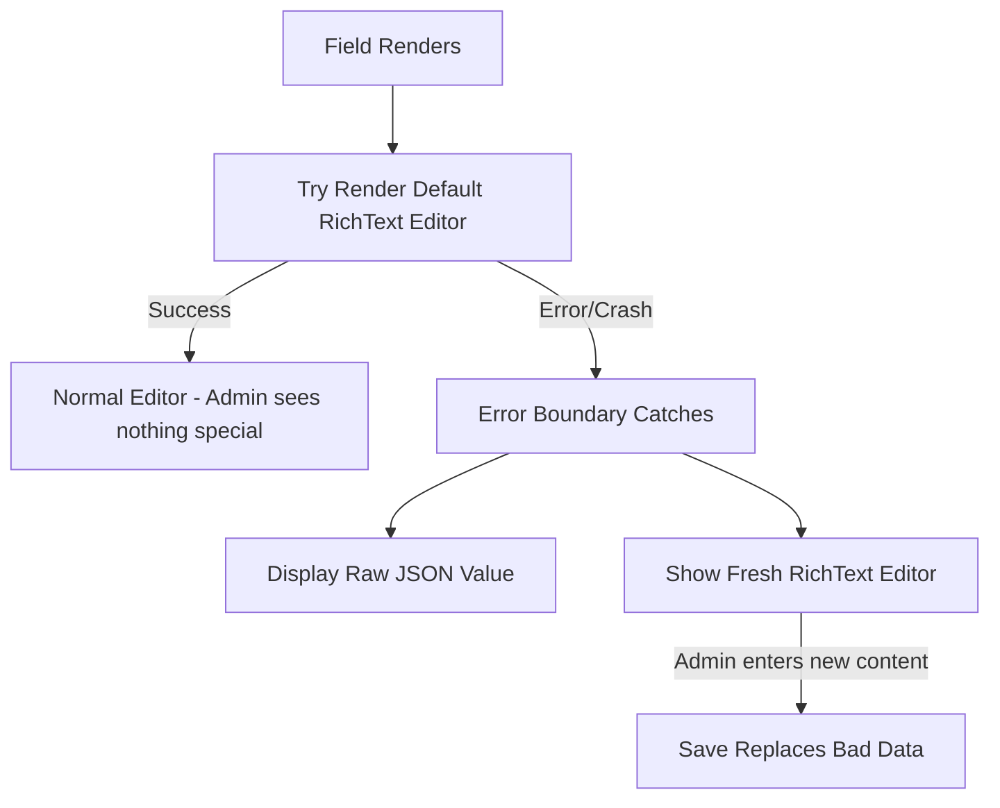

# RichText Error Boundary Component Plan

## Architecture Overview



## Core Concept

This is an **error boundary pattern** - the component wraps the default richText field and:

1. **Happy Path**: Lexical editor renders successfully → admin sees the normal editor, completely unaware this component exists
2. **Error Path**: Lexical editor throws an error → component catches it and shows:

   - The raw field value from the database (JSON.stringify dump)
   - A fresh richText editor to create properly formatted replacement content

## Implementation Details

### 1. Create the Error Boundary Component

Create `src/components/admin/RichTextErrorBoundary.tsx`:

- **Client Component** - Uses React error boundary pattern with state
- Uses `useField` hook to get the raw field value and setValue
- Wraps the default RichTextField in a try/catch boundary
- On error: displays fallback UI with raw data + fix editor
```tsx
'use client'
import { Component, useState } from 'react'
import { useField } from '@payloadcms/ui'
import { RichTextField } from '@payloadcms/richtext-lexical/client'

// React Error Boundary class component to catch render errors
class RichTextErrorBoundary extends Component {
  state = { hasError: false }
  
  static getDerivedStateFromError() {
    return { hasError: true }
  }
  
  render() {
    if (this.state.hasError) {
      return this.props.fallback
    }
    return this.props.children
  }
}
```


### 2. Fallback UI Component

When an error is caught, show:

```tsx
function RichTextFallback({ rawValue, path, field }) {
  const { setValue } = useField({ path })
  
  return (
    <div>
      <h4>Data Formatting Error</h4>
      <p>The existing data cannot be displayed. Raw value:</p>
      
      {/* Raw JSON dump - whatever is in the database */}
      <pre style={{ 
        background: 'var(--theme-elevation-100)',
        padding: 'var(--base)',
        overflow: 'auto',
        maxHeight: '200px'
      }}>
        {JSON.stringify(rawValue, null, 2)}
      </pre>
      
      {/* Fresh richText editor to fix it */}
      <h4>Enter corrected content:</h4>
      <RichTextField 
        path={path}
        field={field}
        // Start with empty/null so admin gets a clean slate
      />
    </div>
  )
}
```

### 3. Main Wrapper Component

```tsx
export function RichTextWithErrorBoundary(props) {
  const { value } = useField({ path: props.path })
  
  return (
    <RichTextErrorBoundary
      fallback={
        <RichTextFallback 
          rawValue={value} 
          path={props.path}
          field={props.field}
        />
      }
    >
      {/* Try to render the normal richText field */}
      <RichTextField {...props} />
    </RichTextErrorBoundary>
  )
}
```

### 4. Field Configuration

Apply to richText fields in collections:

```typescript
{
  name: 'description',
  type: 'richText',
  admin: {
    components: {
      Field: '/components/admin/RichTextErrorBoundary#RichTextWithErrorBoundary',
    },
  },
}
```

### 5. Files to Create/Modify

- `src/components/admin/RichTextErrorBoundary.tsx` - Create: Error boundary + fallback UI
- `src/collections/Programs.ts` - Modify: Add component to description field  
- `src/collections/Persons.ts` - Modify: Add component to featuredStory field

## Key Points

- Admin experience is **unchanged** when data is valid (happy path)
- Only shows the error UI when Lexical cannot render the content
- Raw value is displayed as-is via `JSON.stringify` - no parsing or computation
- Fresh editor allows admin to create properly formatted content that replaces the bad data
- Regenerate import map after creating: `pnpm payload generate:importmap`