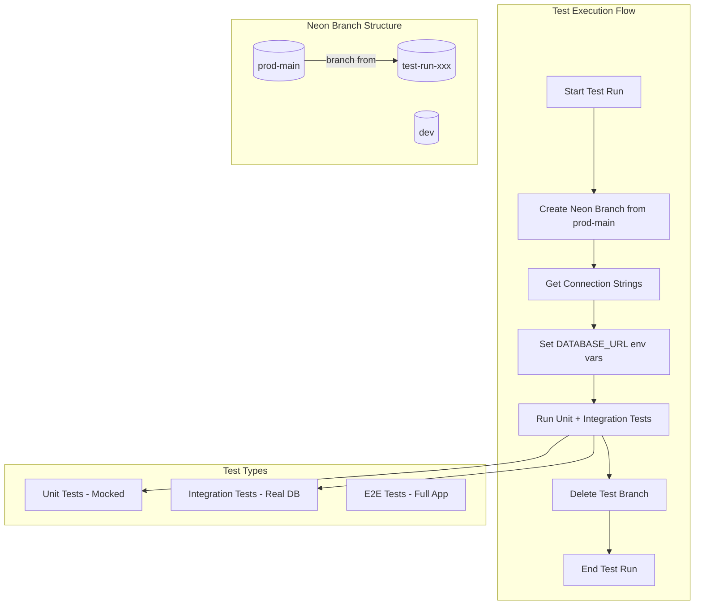

# Testing Workflow with Isolated Neon Database Branches

## Architecture Overview



## Key Files to Create/Modify

### 1. Test Database Utilities

Create [`tests/utils/neon-branch.ts`](apps/track-record/tests/utils/neon-branch.ts) - Neon branch management utilities:

```typescript
// Core functions to implement:
export async function createTestBranch(): Promise<TestBranchInfo>;
export async function deleteTestBranch(branchId: string): Promise<void>;
export function getTestConnectionString(branchName: string): Promise<string>;
```

Uses the **Neon API** (via `@neondatabase/api-client` package) rather than CLI for programmatic access:

- Project ID: `icy-snow-28111680`
- Parent branch: `prod-main`
- Branch naming: `test-run-{timestamp}-{random}`

### 2. Vitest Global Setup/Teardown

Modify [`vitest.config.mts`](apps/track-record/vitest.config.mts) and create [`vitest.setup.ts`](apps/track-record/vitest.setup.ts):

- **globalSetup**: Creates Neon test branch, exports connection strings
- **globalTeardown**: Deletes the test branch
- **setupFiles**: Initializes Payload with test database connection

### 3. Test Organization Structure

```
tests/
├── utils/
│   ├── neon-branch.ts          # Neon branch management
│   ├── test-payload.ts         # Payload client singleton
│   ├── fixtures.ts             # Test data factories
│   └── helpers.ts              # Common test utilities
├── unit/
│   ├── lib/
│   │   └── *.unit.spec.ts      # Pure function tests (mocked)
│   └── components/
│       └── *.unit.spec.ts      # Component tests (mocked)
├── int/
│   ├── api.int.spec.ts         # API integration tests
│   ├── collections/
│   │   └── *.int.spec.ts       # Collection CRUD tests
│   └── workflows/
│       └── *.int.spec.ts       # Business logic tests
└── e2e/
    └── *.e2e.spec.ts           # Full app E2E tests
```

### 4. Test Scripts in `package.json`

```json
{
  "scripts": {
    "test": "pnpm test:unit && pnpm test:int",
    "test:unit": "vitest run --config ./vitest.unit.config.mts",
    "test:int": "vitest run --config ./vitest.int.config.mts",
    "test:e2e": "playwright test",
    "test:all": "pnpm test && pnpm test:e2e",
    "test:watch": "vitest --config ./vitest.int.config.mts"
  }
}
```

### 5. Separate Vitest Configs

- [`vitest.unit.config.mts`](apps/track-record/vitest.unit.config.mts): Unit tests (no DB, mocked dependencies)
- [`vitest.int.config.mts`](apps/track-record/vitest.int.config.mts): Integration tests (with global setup for Neon branch)

## Implementation Details

### Neon Branch Management

Using the Neon API client (`@neondatabase/api-client`):

1. **Create branch**: `POST /projects/{project_id}/branches` with parent `prod-main`
2. **Get connection string**: `GET /projects/{project_id}/connection_uri`
3. **Delete branch**: `DELETE /projects/{project_id}/branches/{branch_id}`

Required environment variable: `NEON_API_KEY` (for test runs)

### Test Isolation Guarantees

1. Each test run gets a fresh branch from `prod-main`
2. Branch created in `globalSetup`, deleted in `globalTeardown`
3. Tests can modify data freely without affecting other environments
4. Parallel test execution supported within a single branch

### Test Fixtures and Factories

Create reusable factories in [`tests/utils/fixtures.ts`](apps/track-record/tests/utils/fixtures.ts):

```typescript
export const createTestPerson = async(payload, (overrides = {}));
export const createTestEvent = async(payload, (overrides = {}));
export const createTestProgram = async(payload, (overrides = {}));
```

### AI Agent Test Patterns

Create [`tests/TESTING_GUIDE.md`](apps/track-record/tests/TESTING_GUIDE.md) with:

- Test naming conventions
- When to use unit vs integration tests
- Example test templates
- How to add new test cases
- Fixture usage patterns

## Environment Variables

Add to `.env.test` (new file):

```env
NEON_API_KEY=your-api-key
NEON_PROJECT_ID=icy-snow-28111680
```

## CI/CD Integration

Tests will work in GitHub Actions with:

1. `NEON_API_KEY` stored as repository secret
2. Test job creates branch, runs tests, cleans up
3. Branch cleanup happens even on test failure (via `finally` block)

## Error Handling

- If branch creation fails: Skip tests, log error
- If tests fail: Still delete branch in teardown
- If branch deletion fails: Log warning (branch has TTL and will auto-delete)