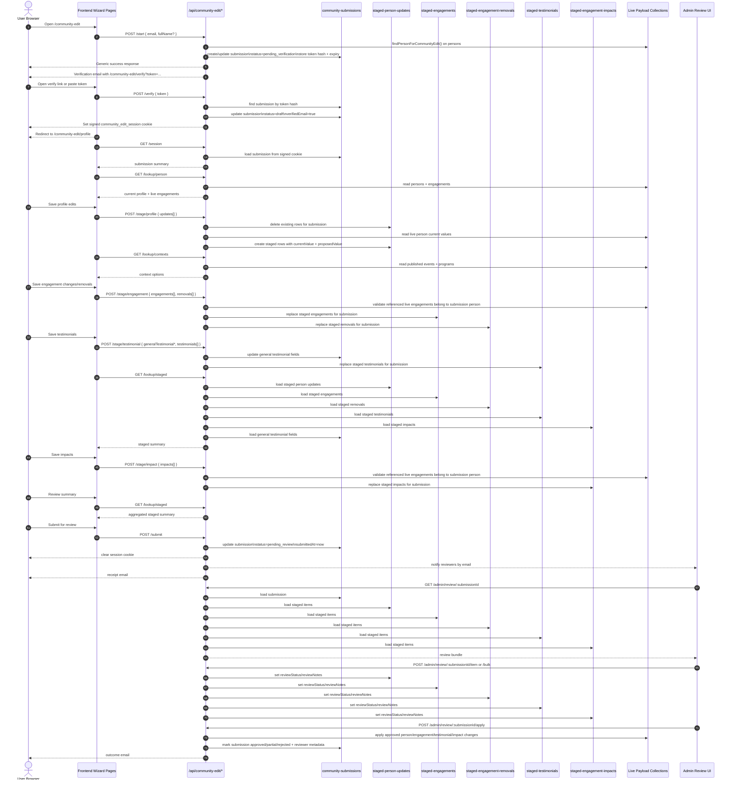

# Session Metadata

- Date/time: 2026-03-02 15:25:43 SAST
- Branch: `feat/community-profile-edits`
- Base branch used for comparison: not explicitly compared in this session
- Current repo state: clean working tree before note creation (`git status --short` returned no output)

# Objective and Scope

- Requested: inspect the community edit feature, explain the wizard data flow, identify the files involved, and identify the API endpoints hit.
- In scope:
  - Public wizard flow under `apps/track-record/src/app/(frontend)/community-edit/*`
  - Public API flow under `apps/track-record/src/app/(payload)/api/community-edit/*`
  - Payload staging collections used by the wizard
  - Admin review/apply loop after submission
- Out of scope:
  - Changing wizard behavior
  - Running end-to-end tests
  - Reviewing unrelated app flows

# Implementation Log

1. Traced the frontend request layer in `apps/track-record/src/app/(frontend)/community-edit/_lib/api.ts`.
   - Confirmed all wizard fetches go to `/api/community-edit/*` with `credentials: 'include'`.
2. Traced wizard pages:
   - `apps/track-record/src/app/(frontend)/community-edit/page.tsx`
   - `apps/track-record/src/app/(frontend)/community-edit/verify/page.tsx`
   - `apps/track-record/src/app/(frontend)/community-edit/profile/page.tsx`
   - `apps/track-record/src/app/(frontend)/community-edit/engagements/page.tsx`
   - `apps/track-record/src/app/(frontend)/community-edit/testimonials/page.tsx`
   - `apps/track-record/src/app/(frontend)/community-edit/impacts/page.tsx`
   - `apps/track-record/src/app/(frontend)/community-edit/review/page.tsx`
3. Traced public API handlers:
   - `apps/track-record/src/app/(payload)/api/community-edit/start/route.ts`
   - `apps/track-record/src/app/(payload)/api/community-edit/verify/route.ts`
   - `apps/track-record/src/app/(payload)/api/community-edit/session/route.ts`
   - `apps/track-record/src/app/(payload)/api/community-edit/lookup/person/route.ts`
   - `apps/track-record/src/app/(payload)/api/community-edit/lookup/contexts/route.ts`
   - `apps/track-record/src/app/(payload)/api/community-edit/lookup/staged/route.ts`
   - `apps/track-record/src/app/(payload)/api/community-edit/stage/profile/route.ts`
   - `apps/track-record/src/app/(payload)/api/community-edit/stage/engagement/route.ts`
   - `apps/track-record/src/app/(payload)/api/community-edit/stage/testimonial/route.ts`
   - `apps/track-record/src/app/(payload)/api/community-edit/stage/impact/route.ts`
   - `apps/track-record/src/app/(payload)/api/community-edit/submit/route.ts`
4. Traced session and submission resolution helpers:
   - `apps/track-record/src/utilities/community/session.ts`
   - `apps/track-record/src/utilities/community/session-submission.ts`
5. Traced underlying data model:
   - `apps/track-record/src/collections/CommunitySubmissions.ts`
   - `apps/track-record/src/collections/StagedPersonUpdates.ts`
   - `apps/track-record/src/collections/StagedEngagements.ts`
   - `apps/track-record/src/collections/StagedEngagementRemovals.ts`
   - `apps/track-record/src/collections/StagedTestimonials.ts`
   - `apps/track-record/src/collections/StagedEngagementImpacts.ts`
6. Traced post-submit review/apply flow:
   - `apps/track-record/src/app/(payload)/admin/community-review/[id]/review-client.tsx`
   - `apps/track-record/src/app/(payload)/api/community-edit/admin/review/[submissionId]/route.ts`
   - `apps/track-record/src/app/(payload)/api/community-edit/admin/review/[submissionId]/item/route.ts`
   - `apps/track-record/src/app/(payload)/api/community-edit/admin/review/[submissionId]/bulk/route.ts`
   - `apps/track-record/src/app/(payload)/api/community-edit/admin/review/[submissionId]/apply/route.ts`
   - `apps/track-record/src/utilities/community/review-data.ts`
   - `apps/track-record/src/utilities/apply-submission.ts`
7. Created this handoff note with a sequence diagram for future agents.

# Decision Log

- Treated `community-submissions` as the workflow root record; all wizard state hangs off the current submission ID.
- Treated the signed `community_edit_session` cookie as the effective auth/session boundary for the public wizard.
- Noted that step-saving is mostly replace-based, not append-based:
  - profile staging replaces all `staged-person-updates` for the submission
  - engagement staging replaces all `staged-engagements` and `staged-engagement-removals`
  - testimonial staging replaces all `staged-testimonials` and separately updates `community-submissions.generalTestimonial*`
  - impact staging replaces all `staged-engagement-impacts`
- Included the admin review/apply path because wizard data flow is incomplete without the live-write step.

# Validation Log

- Commands run:
  - `rg -n "community edit|edit community|CommunityEdit|community.*wizard|wizard.*community|community" apps/track-record/src --glob '!**/node_modules/**'`
  - `rg --files apps/track-record/src | rg "community|wizard|edit"`
  - `rg -n "collection: 'communit|slug: 'communit|communities" apps/track-record/src --glob '!**/node_modules/**'`
  - `nl -ba apps/track-record/src/app/'(frontend)'/community-edit/_lib/api.ts`
  - `nl -ba apps/track-record/src/app/'(frontend)'/community-edit/page.tsx`
  - `nl -ba apps/track-record/src/app/'(frontend)'/community-edit/verify/page.tsx`
  - `nl -ba apps/track-record/src/app/'(frontend)'/community-edit/profile/page.tsx`
  - `nl -ba apps/track-record/src/app/'(frontend)'/community-edit/engagements/page.tsx`
  - `nl -ba apps/track-record/src/app/'(frontend)'/community-edit/testimonials/page.tsx`
  - `nl -ba apps/track-record/src/app/'(frontend)'/community-edit/impacts/page.tsx`
  - `nl -ba apps/track-record/src/app/'(frontend)'/community-edit/review/page.tsx`
  - `nl -ba apps/track-record/src/app/'(payload)'/api/community-edit/start/route.ts`
  - `nl -ba apps/track-record/src/app/'(payload)'/api/community-edit/verify/route.ts`
  - `nl -ba apps/track-record/src/app/'(payload)'/api/community-edit/session/route.ts`
  - `nl -ba apps/track-record/src/app/'(payload)'/api/community-edit/lookup/person/route.ts`
  - `nl -ba apps/track-record/src/app/'(payload)'/api/community-edit/lookup/contexts/route.ts`
  - `nl -ba apps/track-record/src/app/'(payload)'/api/community-edit/lookup/staged/route.ts`
  - `nl -ba apps/track-record/src/app/'(payload)'/api/community-edit/stage/profile/route.ts`
  - `nl -ba apps/track-record/src/app/'(payload)'/api/community-edit/stage/engagement/route.ts`
  - `nl -ba apps/track-record/src/app/'(payload)'/api/community-edit/stage/testimonial/route.ts`
  - `nl -ba apps/track-record/src/app/'(payload)'/api/community-edit/stage/impact/route.ts`
  - `nl -ba apps/track-record/src/app/'(payload)'/api/community-edit/submit/route.ts`
  - `nl -ba apps/track-record/src/utilities/community/session.ts`
  - `nl -ba apps/track-record/src/utilities/community/session-submission.ts`
  - `nl -ba apps/track-record/src/collections/CommunitySubmissions.ts`
  - `nl -ba apps/track-record/src/collections/StagedPersonUpdates.ts`
  - `nl -ba apps/track-record/src/collections/StagedEngagements.ts`
  - `nl -ba apps/track-record/src/collections/StagedEngagementRemovals.ts`
  - `nl -ba apps/track-record/src/collections/StagedTestimonials.ts`
  - `nl -ba apps/track-record/src/collections/StagedEngagementImpacts.ts`
  - `nl -ba apps/track-record/src/app/'(payload)'/admin/community-review/'[id]'/review-client.tsx | sed -n '1,340p'`
  - `nl -ba apps/track-record/src/app/'(payload)'/api/community-edit/admin/review/'[submissionId]'/route.ts`
  - `nl -ba apps/track-record/src/app/'(payload)'/api/community-edit/admin/review/'[submissionId]'/item/route.ts`
  - `nl -ba apps/track-record/src/app/'(payload)'/api/community-edit/admin/review/'[submissionId]'/bulk/route.ts`
  - `nl -ba apps/track-record/src/app/'(payload)'/api/community-edit/admin/review/'[submissionId]'/apply/route.ts`
  - `nl -ba apps/track-record/src/utilities/community/review-data.ts | sed -n '1,260p'`
  - `nl -ba apps/track-record/src/utilities/apply-submission.ts | sed -n '1,220p'`
  - `nl -ba apps/track-record/src/services/community-notifications.ts`
  - `nl -ba apps/track-record/src/utilities/community/person-matching.ts`
  - `nl -ba agent-notes/README.md`
  - `ls -1 agent-notes`
  - `git branch --show-current`
  - `git status --short`
  - `date '+%Y-%m-%d %H:%M:%S %Z'`
- Results:
  - Located full public wizard flow and confirmed exact endpoint usage.
  - Confirmed wizard state is persisted server-side in `community-submissions` + `staged-*` collections, with localStorage used only as client draft cache.
  - Confirmed review/apply phase writes approved staged content into live records.
- Blockers/environmental constraints:
  - No runtime requests were exercised; this was a static code trace only.

# Handoff

- Remaining risks:
  - Static analysis only; no live verification of endpoint payloads or UI step ordering under browser navigation edge cases.
  - `stage/removal/route.ts` exists but the main wizard uses `stage/engagement` for bundled removals; standalone removal route was not part of the primary path.
- Pending work:
  - None for documentation; next likely step would be converting this into product-facing docs if needed.
- Suggested next command(s):
  - `git diff -- agent-notes/2026-03-02-community-edit-wizard-data-flow.md`
  - `rg -n "community-edit" apps/track-record/src/app/'(frontend)' apps/track-record/src/app/'(payload)'/api/community-edit`

# Sequence Diagram

